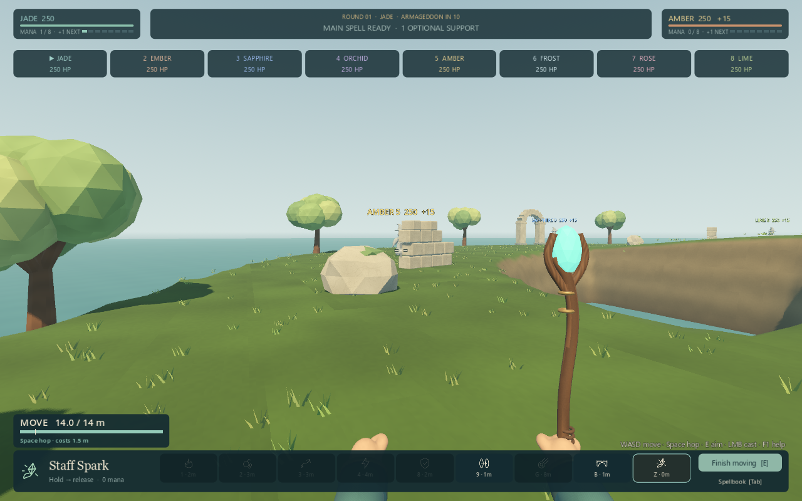
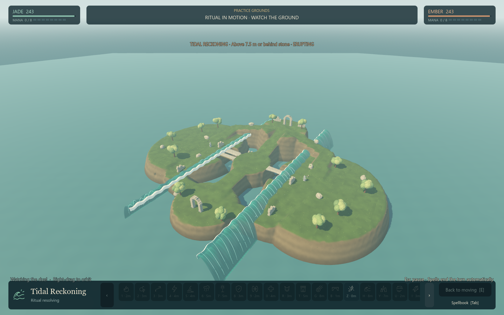
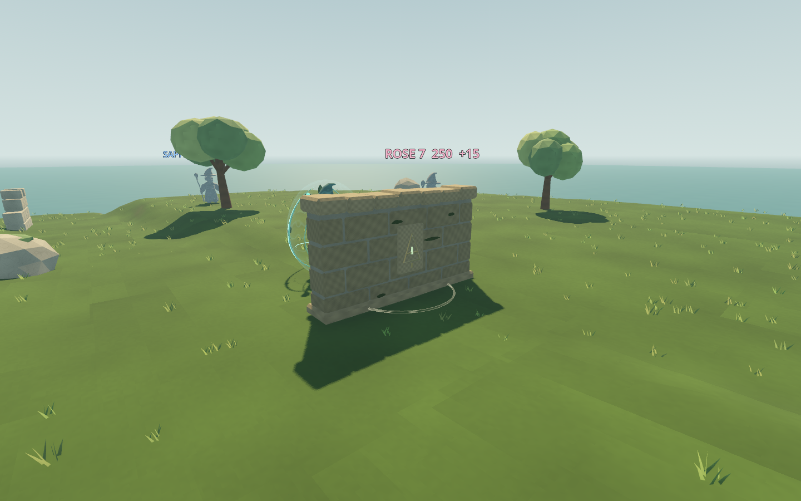
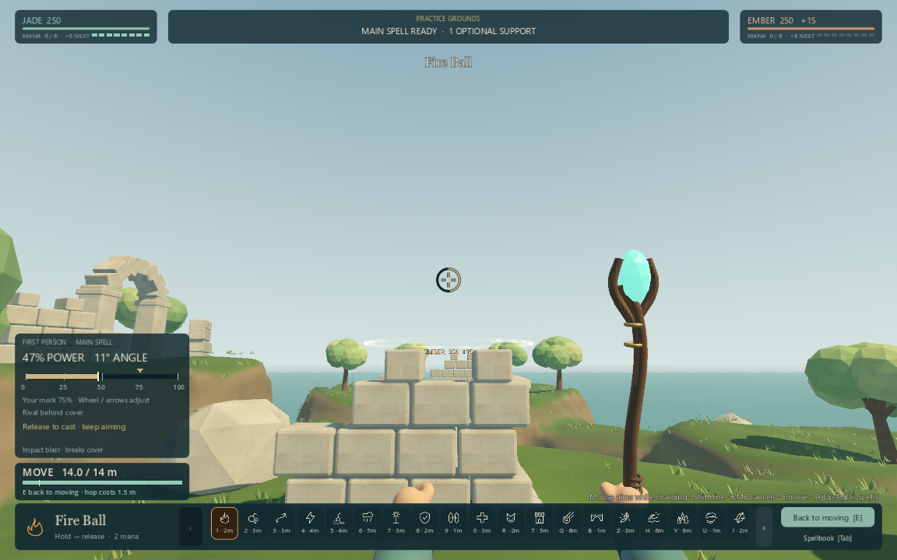

# ARCFALL

**Judge the arc. Break the ground. Be the last wizard standing.**

A first-person, turn-based wizard artillery game. Prepare up to eight spells under a
20-point budget, bank mana for a devastating ritual, and turn your opponent's
cover into a crater. Water is deadly. Position matters as much as damage.

## Download and play

**[Download ARCFALL for Windows x64](https://github.com/rooster4166/Arcfall-Play/releases/latest)**

1. Download the Windows ZIP and extract the entire folder.
2. Open **Arcfall.exe**. Keep the terrain DLL and other files beside it.
3. Choose **Learn to cast**, then **The First Crossing** in **Trials of the Isles** or an AI duel.

No Godot or Blender installation is needed. Requires Windows x64, a keyboard and
mouse, and a graphics card supporting Vulkan or DirectX 12. If the default
Vulkan launch has a graphics problem, close it and try **Play-DirectX12.cmd**.
The build is unsigned. Tested on an RTX 3060 Ti; this is not a measured minimum
hardware specification.

## Choose your battle

- AI duels and four/eight-player free-for-all against AI.
- Six solo Trials with fixed rivals and optional mastery goals.
- Apprentice, Adept and Archmage skirmish opponents, with equal resources.
- Six named personal spellbooks and a combat history explaining each loss.
- Two-player hotseat on one computer.
- Guided practice and a sandbox with all twenty-one spells.
- Three destructible arenas, original 3D artwork, towers, imps and a storm-sea
  finale with time for opponents to respond.

This is a **local game**. There is no online matchmaking. Settled battles save
automatically. **Save and return to shore** suspends a settled battle; **Resume
saved battle** restores it after restarting. Closing during an action returns
to the last safe checkpoint. Starting another normal battle replaces the single
saved battle; practice keeps it.

## Your first spell

**WASD** moves; the movement bar shows how many metres remain. **Space** hops.
Hold **left mouse**, adjust your angle, and release to cast. **Right mouse**
cancels. Power controls travel, not damage. **E** switches between moving and
aiming. **Every spell aims and charges in first person**, including Sky Ray and
Worldsplitter. There is no alternate aiming camera or predicted artillery
landing point. The camera follows the real flight after release, so use the
result to judge your next shot.

**J** leaves your tower, even while aiming; **Tab** opens spellbooks and also offers **Leave tower**. **F2** shows/hides the guide. **Esc** opens settings,
**F11** switches fullscreen, and **O** changes the speed of watching AI turns.
Settings includes optional two-click casting, lower effects and interface scale.

**K** selects Venom Orb: delayed pressure that wards block and Mend cleanses.
**L** selects Stone Wall: destructible cover with open flanks. Eight spellbook
presets support artillery, scouting, siege, poison, control and defensive play.
Opponents evaluate those tools, the terrain and future mana when choosing a turn.
Fire Ball is optional; the Alchemist, Warden and Stormcaller presets use other
tools. Every book retains Blink and the free Staff Spark.

*First-person charging is a controlled GPU review of 1.9.0. The storm is native gameplay from 1.8.1; the wall and eight-player opening are from 1.8.0, with the same art direction.*

All six Trials are available immediately and accept any legal spellbook. Win to
clear a Trial; two optional goals award mastery marks for combinations, varied
attacks or timely victories. Marks unlock no combat advantages. Choose a new
book and retry the same starting situation. Personal books and best marks
persist between launches.

## Prepare, reposition, counterattack

Each turn allows **one optional support, then one main spell**. Blink, Ward,
Mend, Bridge and Stone Wall share that support action and your mana bank.
Blink out of a crater and attack, or cleanse and counterattack. Main spells end
the turn. Income rises from 1 on your first two turns, to 2 from turn 3, 3 from
turn 5, and 4 from turn 8. Bank up to 8; the HUD shows next-turn income.

Ward lasts until your next turn and has two recovery turns. Mend has two uses
per battle, restoring 40 health and clearing poison/roots. Briar binds the next movement turn, with a full
unbound turn afterward; Ward/towers intercept it and Blink/Mend can answer.

**Meteor and Firestorm require a charged beacon to land.** Cover can catch it
early and a sea miss spends the shot. Roofs intercept the descending attack.
Sky Ray keeps precise Ward removal with low damage and recovery. Seeker homes
into intervening obstacles that a carefully arced shot could clear.

**Worldsplitter** is an immediate 36 m ground rupture. **Tidal Reckoning** changes
the surrounding sea into a storm and launches 128 physical water projectiles
from scattered locations over ten seconds, mostly eroding the coast. Every
surviving rival gets a response turn; cover and friendly fire matter.

## Feedback

[Report a problem or share feedback](https://github.com/rooster4166/Arcfall-Play/issues).
For a bug, include the game version, battle size, what happened, and steps to
reproduce it. A screenshot or the relevant lines from
`%APPDATA%/Godot/app_userdata/ARCFALL/logs/godot.log` can help.
Check logs before posting and omit personal information.

[Release notes](CHANGELOG.md) describe the current version; credits and
third-party licenses are included in the ZIP. This repository contains
player-facing release information and downloadable builds.
